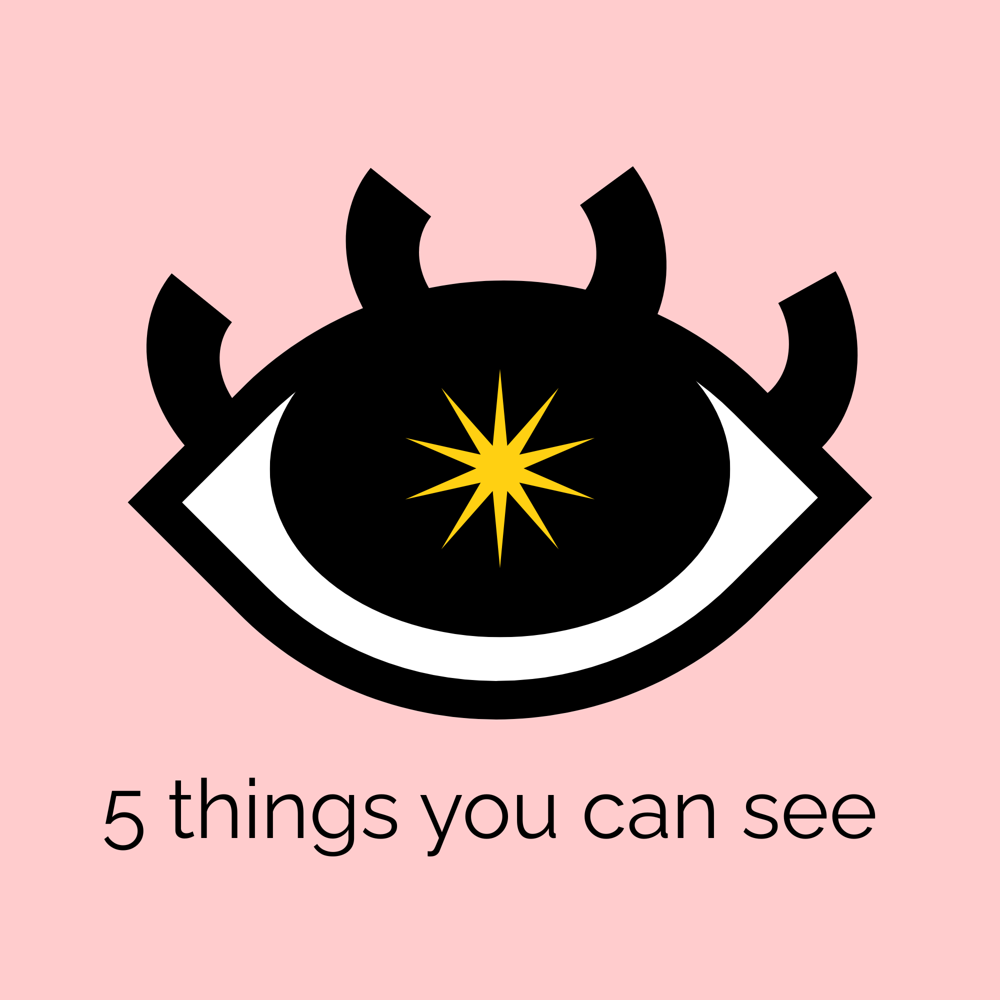

# 5 things you can see



A grounding web app that uses a full-screen camera feed and voice/text interaction to guide sensory focus.

The app supports two interaction modes:

- **Color + shape mode:** user names the displayed color and shape (for example, `blue circle`).
- **Count + shape mode (accessibility):** user names how many shapes appear plus the shape (for example, `4 circles`).

The experience is designed to be calming, lightweight, and deployable as a static-friendly Node service.

## Table of Contents

- [Features](#features)
- [Tech Stack](#tech-stack)
- [Project Structure](#project-structure)
- [Local Development](#local-development)
- [Production Deployment](#production-deployment)
- [Configuration](#configuration)
- [Accessibility & Settings](#accessibility--settings)
- [Privacy & Security](#privacy--security)
- [Browser Support](#browser-support)
- [Troubleshooting](#troubleshooting)
- [Operational Checklist](#operational-checklist)
- [Roadmap](#roadmap)

## Features

- Full-screen front camera feed (`facingMode: user`)
- Smooth shape fade-in/fade-out transitions
- Voice recognition with Web Speech API (plus text fallback)
- Randomized shape prompts in normal mode
- Count + shape colorblind mode (`1-9` shapes)
- Mode explainer popup for count mode
- Start screen with blurred camera until explicit start
- Settings modal with accessibility controls:
  - Colorblind/count mode
  - Flip camera
  - Turn camera off
  - High-contrast overlays
  - Show/hide speech transcript
  - Slow transitions
- Automatic server port fallback when `8000` is busy

## Tech Stack

- **Frontend:** Vanilla HTML/CSS/JavaScript
- **Backend:** Minimal Node.js static HTTP server (`server.js`)
- **Speech:** Browser Web Speech API (`SpeechRecognition` / `webkitSpeechRecognition`)
- **Media:** Browser `getUserMedia`

No frontend build step is required.

## Project Structure

```text
5_things_you_can_see/
├── app.js
├── index.html
├── package.json
├── README.md
├── server.js
└── styles.css
```

## Local Development

### Prerequisites

- Node.js `18+` (recommended)
- A modern browser with camera/microphone support

### Install and run

```bash
cd 5_things_you_can_see
npm start
```

Then open one of:

- `http://localhost:8000`
- If port `8000` is occupied, use the fallback port shown in terminal logs (for example `8001`).

### Validate syntax

```bash
cd 5_things_you_can_see
npm run check
```

## Production Deployment

This app can run directly behind a reverse proxy (recommended) or as a managed Node process.

### Option A: Reverse proxy + Node process

1. Run the app with a process manager (`pm2`, `systemd`, etc.).
2. Set `PORT` to the internal application port.
3. Terminate TLS at a reverse proxy (Nginx/Caddy/Cloudflare).
4. Serve over HTTPS so camera/microphone APIs work reliably.

Example process start:

```bash
cd 5_things_you_can_see
PORT=8080 npm start
```

### Option B: Containerized deployment

Use a lightweight Node image and expose one port behind HTTPS ingress.

## Configuration

Environment variables:

- `PORT` (optional): preferred server port. Defaults to `8000`.

Runtime behavior:

- If `PORT` is unavailable, the server retries the next port(s).
- Camera, mic, and speech behavior depend on browser permissions and support.

## Accessibility & Settings

Open the gear icon to configure:

- **Colorblind support:** switches to count + shape recognition mode.
- **Flip camera:** mirrors/unmirrors preview.
- **Turn camera off:** hides camera feed and uses black background.
- **High contrast overlays:** increases shape visibility.
- **Show speech transcript:** toggles live “heard” feedback.
- **Slow transitions:** extends visual transition timing.

Count mode prompt format:

- “Find and say: `three circles`”
- Accepted input includes numerals and words (`3`, `three`, etc.).

## Privacy & Security

- Camera and mic access are requested from the browser at runtime.
- Media is processed locally in the browser; no remote media upload is implemented in this codebase.
- Use HTTPS in production to ensure media permissions and secure transport.
- Deploy with standard web hardening (reverse-proxy headers, TLS, log controls).

## Browser Support

Best experience:

- Chrome (desktop/mobile)
- Edge

Partial support:

- Safari may have limited or inconsistent speech recognition support.

Fallback:

- If speech recognition is unavailable, use the text input path.

## Troubleshooting

### Camera or mic not starting

- Confirm browser permissions are granted.
- Confirm the site is opened in a secure context (`https` or `localhost`).
- Ensure no OS-level privacy controls are blocking access.

### Speech recognition not working

- Try Chrome/Edge.
- Use text fallback input.
- Disable restrictive privacy extensions and retry.

### Port already in use

- The app auto-retries on next ports.
- Use the URL printed in startup logs.

### Shapes not visible

- Check if camera is turned off in settings.
- Enable high-contrast overlays.
- Disable conflicting custom CSS overrides.

## Operational Checklist

- Serve over HTTPS.
- Pin Node runtime version in deployment environment.
- Run `npm run check` in CI before release.
- Validate browser permissions and speech fallback path.
- Smoke-test settings toggles before rollout.

## Roadmap

- Persist settings in local storage
- Add keyboard-only accessibility shortcuts
- Add optional audio pacing cues
- Add multilingual speech recognition support
